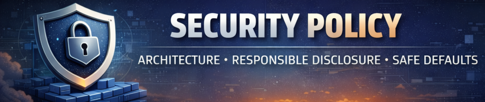

# 🔐 Security Policy — Discord Bot Template

This document defines how security is treated, evaluated, and reported  
within the **Discord Bot Template** project.

Security in this repository is **not an afterthought** or a compliance checkbox.  
It is a **design constraint** that directly influences architecture, error handling,
configuration boundaries, and extension patterns across the entire codebase.

---

## 📚 Table of Contents

- [Overview](#-overview)
- [Supported Versions](#-supported-versions)
- [Reporting a Vulnerability](#-reporting-a-vulnerability)
- [What to Include in a Report](#-what-to-include-in-a-report)
- [Response Timeline](#-response-timeline)
- [Disclosure Policy](#-disclosure-policy)
- [Scope of This Policy](#-scope-of-this-policy)
- [Security Philosophy](#-security-philosophy)

---

## 🔐 Overview

⬆️ [(back to table of contents)](#-table-of-contents)

The **Discord Bot Template** is a production-grade foundation designed with:

- **explicit validation**,
- **controlled failure modes**,
- **predictable execution flow**,

as first-class concerns.

This repository is a **template**, not a hosted or managed service.  
Its purpose is to provide **secure architectural defaults** that downstream
projects can safely extend and adapt.

Although the template itself does not operate as a live bot instance,
security issues related to:

- environment and configuration handling,
- credential and token safety,
- permission enforcement and guard logic,
- centralized error handling and reporting,
- dependency management and update strategy,

are treated with **high priority**.

---

## 🧩 Supported Versions

⬆️ [(back to table of contents)](#-table-of-contents)

Security updates apply **only** to the current integration branch.

| Branch / Version           | Supported  |
|----------------------------|------------|
| `develop`                  | ✅ Yes      |
| `historical tags`          | ❌ No       |
| `forks / derived projects` | ❌ No       |

> This repository follows an **active development model**.  
> Only the latest state of the integration branch receives
> security-related fixes and improvements.

Once custom logic is introduced, downstream projects and forks
are responsible for maintaining their **own security posture**.

---

## 🚨 Reporting a Vulnerability

⬆️ [(back to table of contents)](#-table-of-contents)

If you discover a security vulnerability, **please do NOT open a public issue**.

Responsible disclosure helps prevent unnecessary exposure
for users of the template and downstream implementations.

### Preferred Method

- **GitHub Private Vulnerability Reporting**

This allows issues to be reviewed, validated, and resolved
without public disclosure before a fix is available.

### Alternative

- Contact the maintainer via the **official Discord developer server**
  linked on the GitHub profile associated with this repository.

This server is intended for **professional developer collaboration**
and may be used to coordinate responsible security disclosures
and technical follow-up.

---

## 📄 What to Include in a Report

⬆️ [(back to table of contents)](#-table-of-contents)

To allow efficient assessment and triage, please include:

- a clear and concise description of the vulnerability,
- steps to reproduce (proof-of-concept if available),
- affected files, modules, or architectural components,
- potential impact (e.g. token leakage, privilege escalation),
- clarification whether the issue affects:
  - the template itself, or
  - only downstream implementations.

Reports that include **clear technical context**
can be evaluated and resolved significantly faster.

---

## ⏱️ Response Timeline

⬆️ [(back to table of contents)](#-table-of-contents)

Security reports are reviewed manually.

- **Initial acknowledgment:** within **72 hours**
- **Assessment and triage:** as soon as reasonably possible
- **Fix or mitigation:** depends on severity and scope

Reporters will be kept informed throughout the process.

---

## 📣 Disclosure Policy

⬆️ [(back to table of contents)](#-table-of-contents)

Once a vulnerability has been:

1. confirmed,
2. resolved or mitigated,
3. and integrated into the supported branch,

we may:

- publish a security advisory,
- document the fix in release notes or changelogs,
- credit the reporter (upon request).

No vulnerability details will be disclosed publicly
before a fix or mitigation is available.

---

## 🎯 Scope of This Policy

⬆️ [(back to table of contents)](#-table-of-contents)

This policy applies **only** to vulnerabilities that affect:

- the template’s core architecture,
- configuration validation and environment handling,
- permission and access-control mechanisms,
- centralized error handling and logging systems,
- dependency safety and update strategy,
- developer tooling that may aggregate repository content (e.g. snapshot generators).

Issues introduced by **custom business logic in downstream projects**
are explicitly **out of scope** and should be reported
to the maintainers of those projects.

---

## 🧠 Security Philosophy

⬆️ [(back to table of contents)](#-table-of-contents)

Security in this project is treated as a **structural property**,
not a reactive process.

The template intentionally favors:

- explicit validation over implicit behavior,
- controlled failure over silent errors,
- centralized error handling over ad-hoc fixes,
- safe defaults over convenience,
- local-only diagnostic artifacts for sensitive workflows.

Every architectural decision is made with the assumption
that failures **will occur** — and that they must be:

- visible,
- traceable,
- diagnosable.

Thank you for helping keep this template reliable, secure,
and suitable for **long-term, production-grade Discord applications**.
